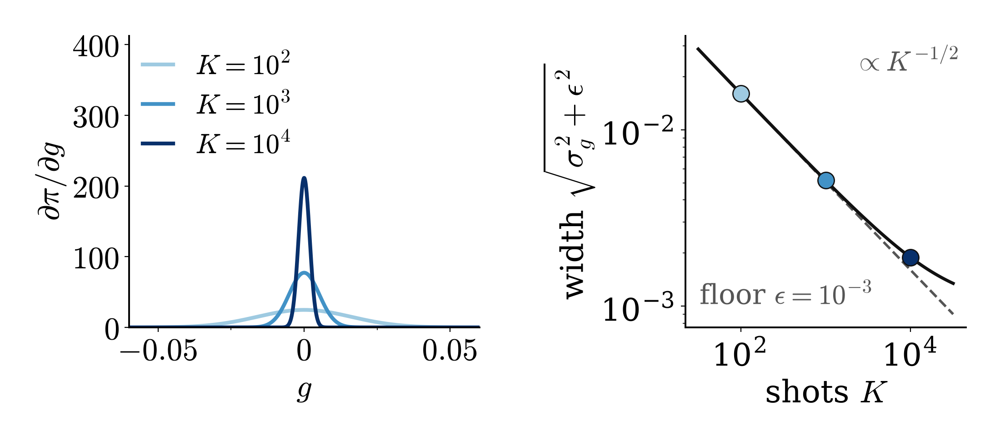

<!-- _class: tight -->

# Strategy $(a,b,c,d)$ are now trainable

| | CY's code (Feb 2026) | now |
|---|---|---|
| input $m$ | single-shot bits $\{0,1\}$ | $K$-shot estimates $[0,1]$ |
| message bit $s$ | deterministic threshold | stochastic: $P(s{=}1)=\pi(g)$ |
| $(a,b,c,d)$ | fixed, or SPSA | backpropagation (all six $g$) |

- Exact gradient $\partial\pi/\partial g=\varphi(g/\sigma)/\sigma$: appreciable only for $|g|\lesssim\sigma\propto K^{-1/2}$
- Shot schedule $K=10^2\to10^4$: $+4.5$ percentage points over fixed $K=10^4$

<figure class="figure">

</figure>

SPSA (simultaneous perturbation stochastic approximation): J. C. Spall, IEEE Trans. Autom. Control 37, 332 (1992).

<!-- Speaker note: the smooth pi(g) has the exact gradient d pi / d g = phi(g/sigma)/sigma, with phi the standard normal density. So all six decision functions (2 rounds x 3 messages) train their normalised (a,b,c,d) and U_+/- with the circuits. The gradient is appreciable only within about sigma_g ∝ K^(-1/2) of the decision boundary g = 0, so shot noise is needed. A fixed large K from the start loses 6.8 (K = 10^3) and 8.4 (K = 10^4) points against K = 10^2; the shot schedule (K increased geometrically from 10^2 to 10^4) recovers 4.5 points over a fixed K = 10^4. These three numbers are from the earlier encoding (phase on |m+1>), not re-measured with the revised one; say so if asked. sigma = sqrt(sigma_g^2 + epsilon^2) is the shot-noise width with the noise floor. CY's rule: a m_i + b m_j + c m_i m_j >= d with fixed (1,1,-1) and threshold 1.5, or SPSA. -->
<!-- Speaker note (former figure caption): the region of non-vanishing gradient narrows as K^(-1/2) down to the noise floor epsilon (illustrative point, not trained values). -->
<!-- src: CY's rule: ~/DQML/README.md §8 ("score = a m_i + b m_{i+1} + c m_i m_{i+1}; if score >= d"; m_i in {0,1} single-shot outcomes), §7 and §8 "Fixed vs Learned" (multi_fixed: coeff and threshold from config.yaml, not trainable; multi: SPSA via gf_step, since the condition inside qml.cond is non-differentiable); ~/DQML/config.yaml (coeff [1,1,-1], threshold 1.5). -->
<!-- src: now: dqml-physics-results.md §0.2 item 4 (K-shot estimated probabilities, probit pi, U_+/U_-), App. B (normalised w = (a,b,c,d)/||(a,b,c,d)||; gradient phi(g/sigma)/sigma appreciable only for |g| <~ sigma ~ K^(-1/2)), §5.0 (2 rounds x 3 links = 6 links, each with its own trained (a,b,c,d) and U_+/-), Fig. 2 caption (24 link coefficients, 36 link rotations in the whole model). -->
<!-- src: 6.8 and 8.4 points (fixed K = 1e3, 1e4 vs K = 100), +4.5 points (K annealed 1e2 -> 1e4 vs fixed 1e4): dqml-physics-results.md §6, "Phase 2c, original encoding, contiguous windows". -->
<!-- src: figure link-gradient.png: 3. wiki/code/lm-260929-animations/fig_link.py, widths 0.0161 / 0.0052 / 0.0019 at (m_i, m_j) = (0.5, 0.1), vector (1,1,-2,-0.5) normalised, epsilon = 1e-3; illustrative, not trained values. -->
<!-- EDIT-FORWARD: CY's README (§4.4, §8) calls the default (1,1,-1) with threshold 1.5 an AND gate, but on bits m_i + m_j - m_i m_j is at most 1 (for (1,1): 1 + 1 - 1 = 1, the README writes 1.5), so "score >= 1.5" is never met and the default bit is constant: U_- is always applied. Checked in ~/DQML/core/layers.py (QCNNRevisedMultiFeedbackPoolingFixed) and ~/DQML/config.yaml. The slide therefore does not call it AND. Decide whether to mention this; CY should confirm. -->
<!-- EDIT-FORWARD: sign convention: the old d is a threshold on the right-hand side (score >= d); the new d enters g with a plus sign (bit 1 when g > 0). The old default threshold 1.5 corresponds to d = -1.5 in the new convention. -->
<!-- EDIT-FORWARD: the 6.8 / 8.4 / 4.5 points are from Phase 2c with the original encoding (dqml-physics-results.md §6); they were not re-measured with the revised Fourier encoding. -->
<!-- EDIT-FORWARD: in CY's SPSA scheme (multi, ~/DQML/core/layers.py QCNNRevisedMultiFeedbackPooling) the rule is m_i + w0 m_j + w1 m_i m_j >= w2, so a is fixed at 1 and only (b, c, threshold) are tuned; one of its four conditions (the RX branch) uses exp(m_i) instead of m_i, which looks like a bug. The table row 'or SPSA' is therefore slightly generous; say 'three of the four coefficients' if asked. -->
