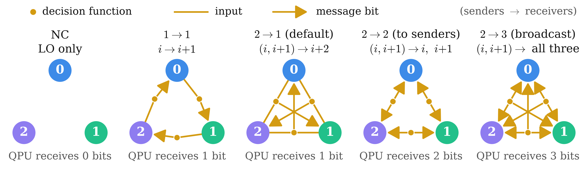

<!-- _class: tight -->

# Method Communication topologies compared: three messages per round

<figure class="figure">

</figure>

- NC (no communication): local operations only (LO); the other four are LOCC, two rounds
- $1\to1$ reads one QPU: $g=a\,m_i+d$
- $2\to1$, $2\to2$, $2\to3$ compute the same three $g(m_i,m_{i+1})$; only the receivers differ

<!-- Speaker note: in 1->1 each decision function reads one QPU, g = a m_i + d. The default is 2->1, (i, i+1) -> i+2. The topologies 2->2 and 2->3 read the same three pairs (i, i+1) as 2->1 and differ only in which QPUs receive each message bit, so they separate what a decision function computes from where its bit goes. Former figure caption: a gold dot is one decision function; it reads the QPUs whose plain lines reach it and sends its message bit along the arrows; below each graph, message bits received per QPU per round (now a legend row inside the figure). -->
<!-- src: patterns and their definitions: 3. wiki/projects/dqml/dqml-physics-results.md §0.2 ("Communication patterns compared (three links per round in every case)" table: none = LO; two-input links (i,i+1) -> i+2 = default, LOCC; one-input links i -> i+1 with g = a m_i + d; fed back: pair (i,j) -> both i and j; broadcast: pair (i,j) -> all three QPUs); "compute the same three two-input tests but deliver each bit to two or three QPUs": §4.3; two measurement rounds at n = 4: §0.2 item 3 and §5.0. -->
<!-- src: figure link-patterns.png: 3. wiki/code/lm-260929-animations/fig_link.py (legend row "decision function / input / message bit" and the labels "QPU receives n bits" (per round) added 2026-09-29 in place of the caption); _verify() checks three links per round, the pair sets, and the bits received per QPU per round (0, 1, 1, 2, 3), which follow from the definitions. -->
<!-- EDIT-FORWARD: the figure is drawn as three-node graphs; a decision function that reads two QPUs sits on the edge between them, so in 2->1 (wiki: "two-input") the three arrows to the opposite QPUs cross in the middle of the triangle. CY's README §7 names the default "joint cyclic feedback" and the one-input pattern "one-way cyclic"; the wiki calls the five none / one-input / two-input / fed back / broadcast; the deck glossary labels NC / 1->1 / 2->1 / 2->2 / 2->3 are used here. -->
