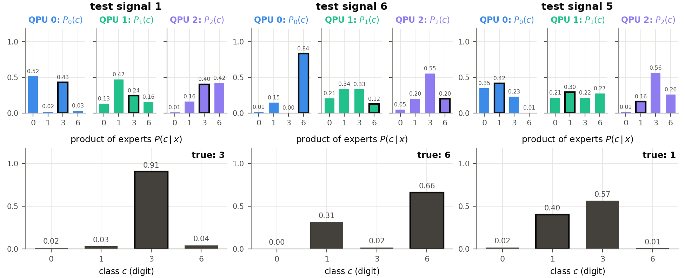

<!-- _class: tight -->

# Results The trained model on three test signals

- Trained model with classical communication (CC), seed $0$; top: each QPU's $P_b(c)$, bottom: the product
- Signal 1: every QPU alone is wrong; the product gives digit 3 probability $0.91$
- Signal 6: QPU 0 vetoes 1 and 3; signal 5: one confident wrong QPU outvotes two

<figure class="figure">

</figure>

<!-- Speaker note: the two output qubits of QPU b have four outcomes, one per digit: a distribution P_b(c) over c in {0,1,3,6}. The prediction is the normalised product, and the predicted class is its argmax. A uniform P_b changes nothing; a factor near zero vetoes that class. The readout has no trainable parameters. Without communication (NC) it is naive Bayes over the feature blocks: it misses evidence that lies only in the joint behaviour of two blocks, which the message bits were designed to carry (on contiguous blocks their gain is mostly calibration, dqml-physics-results.md §4.2). The figure is the real trained model with classical communication (CC, 2 senders -> 1 receiver), three QPUs of 4 qubits, seed 0, evaluated at K = 10^4 shots: for three test signals, each QPU's P_b(c) (top) and the product (bottom); the true digit's bar is outlined. The three signals were picked by rules fixed before looking at the bars: test signal 1 (the digit 3 of the worked example), the lowest-index other signal that the product gets right although at least two QPUs alone are wrong, and the lowest-index misclassified signal. -->
<!-- Speaker note (the three signals): (1) digit 3. The QPUs alone vote 0, 1 and 6, but 3 is every QPU's second choice (0.43, 0.24, 0.40), while each first choice is rated low by at least one other QPU; the product gives 3 a probability of 0.91. (6) digit 6. QPU 1 votes 1 and QPU 2 votes 3, and both rate 6 low (0.12 and 0.20); QPU 0 says 6 with 0.84 and gives 3 almost nothing (0.00) and 1 only 0.15, which vetoes the other two choices; the product gives 6 0.66 against 0.31 for 1. (5) digit 1, an error. QPUs 0 and 1 favour 1 weakly, but QPU 2 puts 0.56 on 3 and only 0.16 on 1; the product ends at 0.57 for 3 against 0.40 for 1: one confident dissenter outweighs two weak correct votes. -->
<!-- src: equation and readout: dqml-physics-results.md §0.2 item 5 (two output qubits per QPU give P_b(c) over the four classes; P(c|x) ∝ prod_b P_b(c), product of experts, cross-entropy loss); App. A (log P(c|x) = sum_b log Tr[E_c^(b) rho_b] + const). dqml-physics-plan.md §1 (fixed code {0,1,3,6} -> {00,01,10,11}, same for every QPU; normalised product; "It has no parameters"; "Why the product": with blocks conditionally independent given the class and balanced classes, the product of local posteriors is the global posterior, so the communication-free model is a quantum naive-Bayes classifier over blocks). Product of experts, "veto": G. E. Hinton, Neural Comput. 14, 1771 (2002) (visible source line under the equation). -->
<!-- src: figure media/readout-trained-examples-crop.png = media/readout-trained-examples.png (dqml-physics-results.md Fig. 9, from ~/DQML/analysis/phys-explain/out/readout-trained-examples.png, readout.py, Colab CPU, 2026-09-29, CC model, seed 0; log.md "[2026-09-29] simulate | DQML — per-signal product-of-experts readout") with blank pixel rows trimmed (top and bottom margins and two inner bands; nothing redrawn) by 3. wiki/code/lm-260929-animations/fig_readout.py crop_examples(), which asserts that every removed row is blank. Model: §4.5 "What was computed" (CC: 3 QPUs × 4 qubits, revised encoding = phase on |b(m)>, contiguous windows, two-input links (i,i+1) -> i+2, seed 0, K = 10^4; P_b(c) exactly as it enters the training loss, with CC the mixture over the message bits); the CC model reproduces its recorded test accuracy 0.905109. Bullets and notes: §4.5 "Examples" (a) "The QPUs alone vote 0, 1 and 6 ... The product gives digit 3 a probability of 0.91"; (b) test signal 6, "which vetoes the other two choices"; (c) test signal 5 (digit 1), the lowest-index misclassified signal (product 0.57 for 3 against 0.40 for 1), "one confident dissenter outweighs two weak correct votes", hence "one confident wrong QPU" on the slide. fig_readout.py _verify() checks these phrases verbatim. -->
<!-- 2026-09-29 (speaker: "the animation which was previously in Page 38 is worth to stay"): the illustrative clip is back on 49-readout.md with the equation; this slide (49-readout1.md) keeps the trained model's Fig. 9 and its three bullets; the equation moved to 49-readout.md. Earlier history: (readout editor): rebuilt around the actual model on the human's request ("it is worth to see how actual model worked"; "Did you check and add actual data in 49-readout.md?"). Removed from this slide: the illustrative clip poe-readout (scenes_readout.py PoEReadout, still renderable; media/poe-readout.mp4/.png moved to _removed/media/ at integration, 2026-09-29) and the seeds 0-2 aggregate bar chart (QPU 1 alone 0.586 against the products 0.865 / 0.908). fig_readout.py now draws the seed-0 per-QPU accuracies of §4.5 for the next slide (49-readout2.md). -->
<!-- Resolved EDIT-FORWARDs (2026-09-29, provenance now on dqml-physics-results.md): (1) 0.586 = QPU 1 alone in the model WITHOUT communication, mean of seeds 0-2 (0.606, 0.589, 0.564; seed 0 = 0.606 is the NC value on the next slide), §2.4 "Per window"; with communication QPU 1 reaches 0.640. (2) §4.2's 0.673 / 0.581 (QPUs 0 / 2 alone with communication) are n = 4, seeds 0-7; QPU 1 0.614 in the same runs; without communication 0.450 / 0.568 / 0.338 (§4.2, bottleneck table of phys-phase2g). (3) the veto is now measured: §4.5 leave-one-out table (next slide's notes) and example signal 6 above. -->
<!-- EDIT-FORWARD (2026-09-29, readout fixer): Fig. 9 is shown 1120 px wide, the most that fits above the footer; its per-QPU value labels are still about 7 px tall at 1280 x 720, too small for a projector. A slide variant with ~1.6x fonts, from readout_examples.csv (not from values read off the PNG), is requested in 260929/HANDOFF-readout-fig9-slide.md as media/readout-trained-examples-slide.png; when it arrives, point the image line at it and re-check the width in a private build. Until then, read signal 1's second choices (0.43, 0.24, 0.40) aloud from the notes. -->
