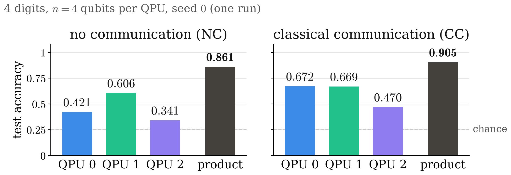

<!-- _class: tight -->

# Results The product is right more often than any QPU alone

<figure class="figure">

</figure>

- **Rescues:** correct signals with at least two QPUs wrong alone: $196$ of $354$ (NC), $82$ of $372$ (CC)
- **With communication,** QPUs 0 and 2 improve most: the message bits bring them a summary of feature block 1

<!-- Speaker note: "QPU b alone" is the argmax of its own P_b(c) inside the trained model, the same P_b that enters the product; "product" is the model's prediction. Same trained models as the examples on the previous slide: three QPUs of 4 qubits, seed 0, all 411 test signals, K = 10^4; the product values are the models' recorded test accuracies, 0.905 = 372/411 (CC) and 0.861 = 354/411 (NC). Without communication only QPU 1, which holds the most informative feature block, is above 0.5 on its own, and the product still reaches 0.861. With communication QPU 0 rises from 0.421 to 0.672 and QPU 2 from 0.341 to 0.470: the message bits deliver a thresholded summary of block 1 to the other QPUs. The product never loses a unanimous vote: in either model no signal is misclassified when all three QPUs alone are right, so every error has at least one dissenting QPU. -->
<!-- Speaker note (if asked about vetoes, leave-one-out): removing one QPU from the product changes the prediction of NC: 141 / 188 / 69 signals (QPU 0 / 1 / 2) and CC: 122 / 36 / 50. In most of these changes the product is right only with that QPU included (NC 112 / 154 / 44, CC 105 / 22 / 29). Without communication QPU 1 is the decisive factor; with communication QPU 0 is. With communication the product is also more confident: mean maximum probability 0.860 against 0.658. -->
<!-- Speaker note (if asked whether seed 0 is typical): these are single runs, so the counts illustrate the mechanism, not estimates with error bars. Over seeds 0-7 (n = 4) the QPUs alone reach 0.673 / 0.614 / 0.581 with communication and 0.450 / 0.568 / 0.338 without; over seeds 0-2, 0.671 / 0.640 / 0.587 and 0.427 / 0.586 / 0.329. Seed 0 was a design seed: do not compare 0.905 with the 0.9 target (held-out seeds 3-7: 0.890, accuracy slide). -->
<!-- src: chart media/readout-trained.png: 3. wiki/code/lm-260929-animations/fig_readout.py fig_accuracy() (2026-09-29, rewritten for the seed-0 readout; header "seed 0 (one run)" per §4.5 "Reading": "one seed per model, so the counts illustrate the mechanism"); _verify() checks every plotted number and every count on this slide verbatim against dqml-physics-results.md §4.5. Numbers: §4.5 table "Accuracy of each QPU alone and of the product (seed 0)": CC 0.672 / 0.669 / 0.470, product 0.905; NC 0.421 / 0.606 / 0.341, product 0.861; "Consistency checks": 0.905109 (CC) and 0.861314 (NC). Models: §4.5 "What was computed" (CC: 3 QPUs × 4 qubits, revised encoding = phase on |b(m)>, contiguous windows, two-input links (i,i+1) -> i+2 = 2 senders -> 1 receiver, seed 0, K = 10^4; NC: the same configuration without communication, seed 0). Code: ~/DQML/analysis/phys-explain/readout.py (WSL, Colab CPU, no training); log.md "[2026-09-29] simulate | DQML — per-signal product-of-experts readout". Chance 0.25 (four balanced classes). -->
<!-- src: product of experts: G. E. Hinton, Neural Comput. 14, 1771 (2002); visible source line on the previous slide (49-readout.md, under the equation), removed here because it collided with the footer. -->
<!-- src: rescues: §4.5 table "Signals the product gets right although single QPUs are wrong" (at least 2 of 3 QPUs wrong: CC 82 of its 372 correct signals, NC 196 of 354; 372/411 = 0.905109 and 354/411 = 0.861314 are the recorded test accuracies, §4.5 "Consistency checks"; all 3 wrong: CC 10, NC 16; product wrong although all 3 right: 0 and 0) and "Reading" ("In 196 of the 354 correct signals at least two of the three QPUs are individually wrong"; "no signal is misclassified when all three QPUs are individually right"). Leave-one-out and confidence: §4.5 tables "Leave-one-out" and "Mean confidence". "Summary of feature block 1": §4.2 "The bits deliver a thresholded summary of window 1 to them" and §4.5 "Reading" (the per-signal form of that statement). Multi-seed values: §4.2 (n = 4, seeds 0-7) and §2.4 "Per window" (seeds 0-2). Held-out 0.890: §3 (accuracy slide). -->
