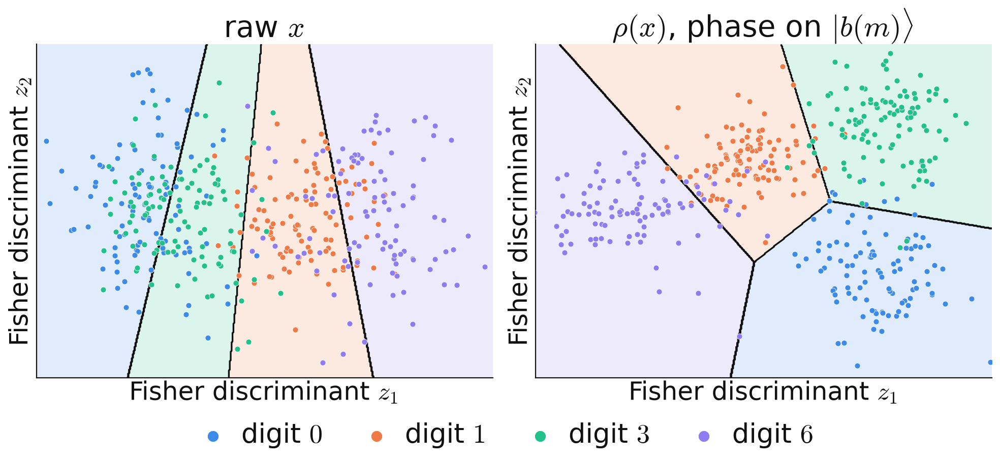
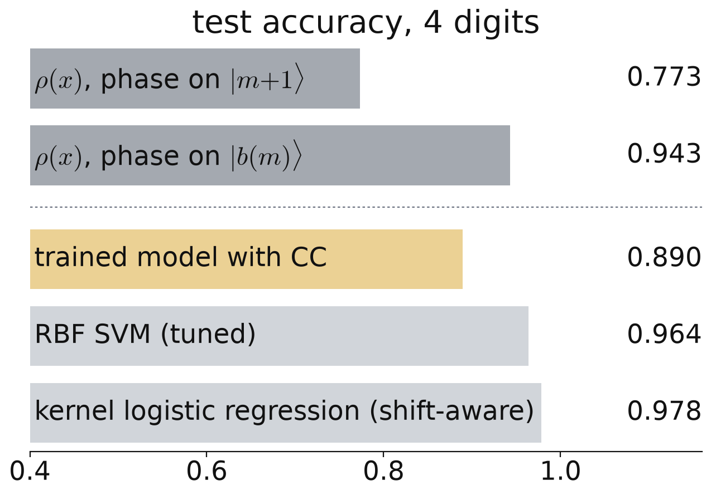

<!-- _class: tight -->

# Results A linear classifier on the encoded states already reaches $0.943$

Logistic regression on the entries of the three encoded states $\rho_b(x)$:
$$\mathrm{score}_c(x)=\sum_{b=0}^{2}\mathrm{Tr}\big[W_c^{(b)}\rho_b(x)\big]+\beta_c,\qquad \hat c=\arg\max_c\,\mathrm{score}_c .$$
A QPU without incoming messages, $P_b(c)=\mathrm{Tr}[E_c\rho_b]$ (POVM elements $E_c$), is such a classifier: this accuracy bounds it.

<figure class="figure">

</figure>
