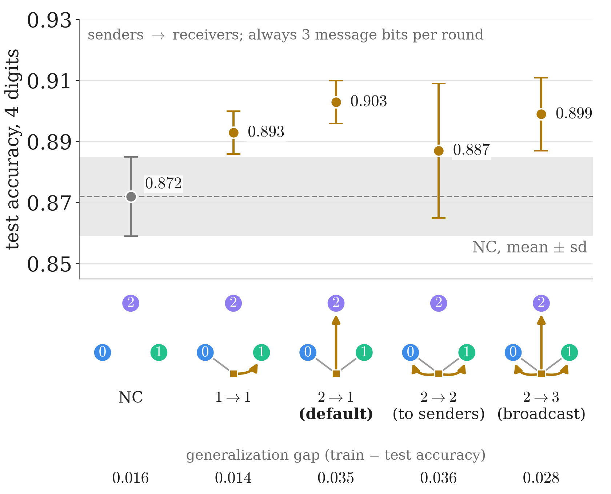

<!-- _class: tight -->

# Results Communication topologies: every one is a good model

<figure class="figure">

</figure>

- Seeds $0$–$4$: every topology beats no communication (NC) by $1.5$ to $3.1$ points; they differ by at most $1.6$, within the seed spread.
- **Two senders vs one:** $77\,\%$ vs $23\,\%$ non-constant decision functions; $+0.9\pm0.5$ points (± standard error), a trend.
- **More receivers do not help:** $2\to2$ and $2\to3$ are no better.

<!-- Speaker note (from the removed caption): n = 4, contiguous blocks, seeds 0-4, mean +- sd; three message bits per round in every topology. Glyph: one of the three classical links of a round (gold square: the decision function g). Bottom row: the generalization gap (train - test accuracy). -->
<!-- Speaker note: two senders vs one: +0.9 +- 0.5 accuracy points, where +- is the Welch standard error of the difference (about 1.8 standard errors: a trend, not significant on accuracy alone, consistent with the first bullet); what clearly differs is how many decision functions use their input: 77 % with two senders, 23 % with one. If asked why the bits matter at all: replacing them by random bits with the same mean makes the model worse than one trained without communication, in every run (the wiki measures this in cross-entropy only, §4.1; no accuracy value is given, so do not quote a number). -->
<!-- 2026-09-29 (speaker, second review: "remove mutual information stuff"): the bullet "2->1 beats 1->1 by 0.10 nats of cross-entropy, with 3x the mutual information I(S;Y)" became an accuracy statement, and the I(S;Y) row of patterns.png was removed (fig_rescomm.py). Fixer pass the same day: "Two senders beat one: +0.9 +- 0.5 points" became "Two senders vs one: 77 % vs 23 % non-constant decision functions; +0.9 +- 0.5 points (+- standard error), a trend", because in accuracy alone the difference is about 1.8 standard errors; the figure row label "gen. gap" became the heading "generalization gap (train - test accuracy)". The nats and bits values below stay only as provenance. -->
<!-- src: dqml-physics-results.md §4.3 table (3 QPUs x 4 qubits, revised encoding, contiguous windows, seeds 0-4): none 0.872 +- 0.013, gap 0.016; one-input 0.893 +- 0.007, gap 0.014, I(S;Y) 0.197; two-input 0.903 +- 0.007, gap 0.035, I(S;Y) 0.594; fed back 0.887 +- 0.022, gap 0.036, I(S;Y) 0.385; broadcast 0.899 +- 0.012, gap 0.028, I(S;Y) 0.362; parameters 1128 / 1176 / 1188 / 1224 / 1260. -->
<!-- src: "1.5 to 3.1 points" and "at most 1.6 points" are differences of the §4.3 means (0.887 - 0.872, 0.903 - 0.872, 0.903 - 0.887), checked in fig_rescomm.py _verify(). Seed spread: the sd column of the same table (0.007 to 0.022). -->
<!-- src: two-input vs one-input +0.9 +- 0.5 accuracy points (on the slide): §4.3 bullet; +- is the Welch standard error of a difference (§0.3 "differences carry +- the Welch standard error"), sqrt(0.007^2/5 + 0.007^2/5) = 0.0044 from the §4.3 sds, and 0.9 against the 1.0 difference of the rounded table means (0.903 - 0.893) is rounding (both checked in fig_rescomm.py _verify()). 0.100 +- 0.025 nats (5/5 seeds) and 0.594 vs 0.197 bits: not quoted since 2026-09-29; feedback / broadcast -1.6 +- 1.1 and -0.4 +- 0.6 points: §4.3 bullets. Fraction of links whose bit depends on the input, 0.77 (two-input) vs 0.23 (one-input): §4.3 table. Random-bit replacement: §4.1 (worse than the model trained without communication in 16 of 16 runs on contiguous windows, measured in cross-entropy; not quoted since 2026-09-29). "Non-constant" for "bit depends on the input": GLOSSARY.md (constant vs non-constant decision functions). -->
<!-- 2026-09-29 integrator: "Seeds 0–4" added to the first bullet so that NC 0.872 / 2->1 0.903 here are not read against the held-out seeds 3-7 values of the accuracy slide (0.878 / 0.890) or the seeds 0-2 values of the encoding slide (0.865 / 0.908). -->
<!-- Figure: 3. wiki/code/lm-260929-animations/fig_rescomm.py (fig_patterns), 2026-09-29 (in-figure note "always 3 message bits per round" added when the caption was removed; I(S;Y) row removed and y-label "test accuracy, 4 digits" in the second review), numbers copied from §4.3; no simulation. -->
<!-- EDIT-FORWARD: the wiki's "16 of 16 runs" (§4.1) pools the 4-qubit and 6-qubit models; the n = 4 share is presumably 8 of 8 (seeds 0-7, §4.2) but the split is not stated, so the speaker note says "in every run". The n = 4 random-bit comparison is a cross-entropy value (§4.1): not to be quoted since 2026-09-29; answer in accuracy (no accuracy value exists in the vault). -->
<!-- EDIT-FORWARD: numbers cut from the slide for space, quote them if asked: feedback and broadcast lose 1.6 +- 1.1 and 0.4 +- 0.6 points against 2->1 despite more parameters (1224, 1260 vs 1188); seed spread sd 0.007 to 0.022 (§4.3). The +0.9 +- 0.5 points of 2->1 over 1->1 is about 1.8 Welch standard errors (§0.3), so the slide calls it a trend; until 2026-09-29 the bullet said "Two senders beat one", which rested on 0.100 +- 0.025 nats of cross-entropy on 5 of 5 seeds (no longer quoted). -->
<!-- EDIT-FORWARD: the two-input model has the largest train-test gap (0.035 against 0.016 without communication); §3 attributes the gap mostly to the bits. Mention it if someone asks why 0.903 is not the whole story. -->
