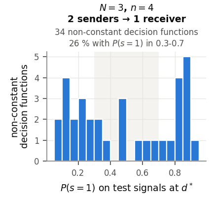

<!-- _class: tight -->

# Results What the trained decision functions compute

$6$ decision functions per model $\times$ seeds 0–7 $=48$, read at the corners $\{0,1\}^2$:

| Boolean function | count |
|---|---|
| constant | 14 |
| dictator or its negation ($m_i$, $\lnot m_j$, …) | 20 |
| implication and its variants ($\lnot m_i\lor m_j$, …) | 9 |
| AND, NAND, NOR | 5 |
| XOR | 0 |

- Many ignore an input: constant, or one QPU's estimate only. Task or trainability? Open.
- The $34$ non-constant ones are mostly unbalanced: only $26\,\%$ have $P(s=1)$ in $0.3$–$0.7$; the bit flags a subgroup of signals.

<figure class="figure">

</figure>

<!-- Speaker note (from the removed caption): the figure shows the 34 non-constant decision functions at K = 10^4: a histogram of P(s = 1), the fraction of test signals for which the bit is 1, at the trained bias d* (shaded band 0.3-0.7: roughly balanced). Most sit near 0.1 or 0.9: the bit is the same for most signals and flips for a minority, so it detects a specific group of signals. Six decision functions = 2 rounds x 3 messages. -->
<!-- 2026-09-29 (speaker, second review: "remove mutual information stuff"): the bullet "trained bias d* near the maximum of the mutual information I(S;Y), not of the entropy H(S) (between data clusters)" and the figure's bottom panel (distance from d* to the maxima of H(S) and I(S;Y)) were removed; fig_resabcd.py now crops only the top panel. The H / I(S;Y) provenance below is kept for reference only. -->
<!-- src: 6 links per model (2 rounds x 3 links), the 48-link table (constant 14, one variable 20, implication type 9 = NOT m_i OR m_j, m_i OR NOT m_j, m_i AND NOT m_j, NOT m_i AND m_j, AND/NAND/NOR 5, XOR 0; revised encoding, two-input links, contiguous windows, seeds 0-7): dqml-physics-results.md §5.0 (source ~/DQML/analysis/phys-phase2g/summary/links.csv). Only the 3 x 4-qubit column is used. -->
<!-- src (no longer on the slide since 2026-09-29): "not at the maximum of H(s)" (with 4 qubits 0.17-0.27 away), "low-density region between clusters of the data": dqml-physics-results.md §5.1. "Most of the 34 links within 0.05 of the maximum of I(s;Y)": read off the n = 4 column of Fig. 5 (orange bar 0-0.05 holds about 23 of 34 links; the others lie at 0.05-0.4). Reviewer (rv-resabcd) removed "31 of 31 models" and "0.00-0.05": both are pooled over the Phase 3B groups of §5.1, which include the 6-qubit two-source ring, and "0.00-0.05" is not true link by link for n = 4 (Fig. 5 shows links up to about 0.4 away). The slide said "near" the maximum (for most of the 34, within 0.05 widths) until 2026-09-29. 34 input-dependent links = 48 - 14 constant; "0 of 34 for the 4-qubit two-input links" (XOR): §5.1. -->
<!-- src: figure = the top panel of the N=3, n=4, 2 senders -> 1 receiver column of Fig. 5 (dqml-physics-results-response.png, K = 10^4), with its title, relabelled with standard terms (WSL re-render, 2026-09-28), cropped by 3. wiki/code/lm-260929-animations/fig_resabcd.py (bottom panel dropped 2026-09-29). "26 % with P(s=1) in 0.3-0.7" is printed in that column's title; "most links sit near 0.1 or 0.9 ... the bit works as a detector for a specific group of signals": dqml-physics-results.md §5.1 "How to read Fig. 5", top row. 26 % of 34 is about 9 decision functions (my arithmetic, not quoted). -->
<!-- EDIT-FORWARD: the test-time accuracy scan ("the trained d maximises accuracy, 31 of 31 models", §5.1) is pooled with 6-qubit models, so it is not quoted; the n = 4-only count is in ~/DQML/analysis/phys-3b/README.md (i), which is not on this machine. [unverified for n = 4 alone] -->
<!-- EDIT-FORWARD: the speaker's open question from the outline: are the non-conditional links a property of the task (contiguous windows carry almost no synergy, §5.1) or of trainability (§5.2: a threshold that misses the data never receives a gradient)? Not separated by any run yet. -->
