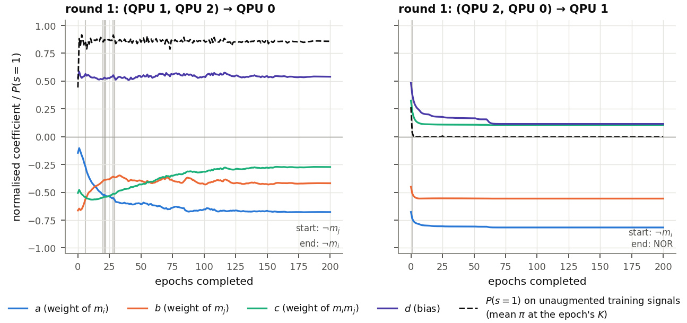

<!-- _class: tight -->

# Results The coefficients move early, then settle

<figure class="figure">

</figure>

Seed 0 (test accuracy $0.905$, 4 digits):

- Four of the six decision functions keep their initial Boolean function; shown are the two that change.
- Left: switches (grey lines), ends as $\lnot m_i$. Right: becomes NOR, then constant.
- Trained, but not dramatically (one seed).

<!-- Speaker note (from the removed caption): seed 0, the normalised (a,b,c,d) of two of the six decision functions (the two whose Boolean function changes, both in round 1) against the epoch (solid) and P(s=1) on the training signals (dashed); the other four panels of the wiki's Fig. 4 show functions that keep their initial Boolean function. Grey vertical lines mark a change of the Boolean function. Seed 0 was retrained with (a,b,c,d) logged every epoch. The coefficients move in the first 25-50 epochs and then settle. The switching one goes through NOT m_j, NAND and NOT m_i during epochs 6-29; the NOR one has P(s=1) below 0.01 from epoch 2 and 0 at the end. -->
<!-- src: seed 0 of the 4-qubit model, test accuracy 0.905; retrained with vectors logged every epoch, reproduces the original run exactly; move substantially during the first 25-50 epochs then settle; four of six keep their initial Boolean function; one switches between NOT m_j, NAND and NOT m_i during epochs 6-29 and ends as NOT m_i; one becomes NOR after a single epoch, P(s=1) (the wiki's "bit rate") below 0.01 from epoch 2 and 0 at the end: dqml-physics-results.md §5.0 ("How the coefficients change during training") and Fig. 4. -->
<!-- src: figure = the round-1 panels (QPU 1, QPU 2) -> QPU 0 and (QPU 2, QPU 0) -> QPU 1 of Fig. 4 (dqml-physics-results-trajectory.png) with the shared y axis of the left panel and the legend, relabelled with standard terms (WSL re-render, 2026-09-28), cut by 3. wiki/code/lm-260929-animations/fig_resabcd.py (media/dqml-physics-results-trajectory-round1.png). Until 2026-09-29 the slide showed all six panels (media/dqml-physics-results-trajectory-crop.png, still written by the script; the old copy moved to _removed/media/ at integration, 2026-09-29); the verifier found its labels about 6 px high at 1280 x 720, so only the two panels the bullets discuss are shown now. Start/end labels read off the panels: "start: NOT m_j, end: NOT m_i" and "start: NOT m_i, end: NOR"; the other four panels keep their function (m_i -> m_i or NOT m_i OR m_j -> NOT m_i OR m_j), matching §5.0. -->
<!-- Checked 2026-09-29 (speaker: "remove mutual information stuff"): the crop has no mutual-information, entropy or information panel or legend entry (neither has the source Fig. 4); the dashed line is P(s=1), the fraction of training signals whose bit is 1, kept because it shows the NOR decision function becoming constant. -->
<!-- EDIT-FORWARD: only seed 0 was logged every epoch (the original runs saved (a,b,c,d) only at the best-validation epoch and the last epoch, §5.0). The speaker wants the other seeds checked: rerun seeds 1-7 with per-epoch logging and test whether the converged (a,b,c,d) stay near their initial values whatever those were (outline item 11). Until then "not dramatically" rests on one seed. -->
