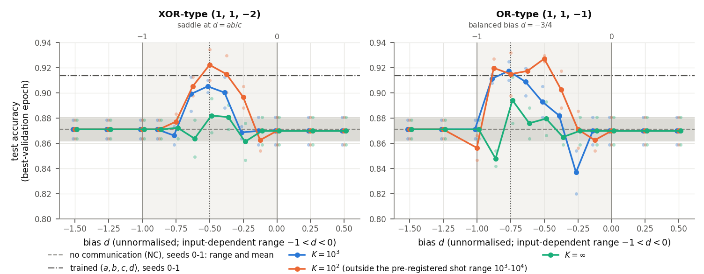

<!-- _class: tight -->

# Results Fixing $(a,b,c)$ and sweeping the bias $d$

<figure class="figure">

</figure>

- Outside the input-dependent range $-1<d<0$ the bit is constant: accuracy equals no communication (NC).
- Training succeeds only near the balanced bias: $d=-\tfrac12$ (XOR-type), $d=-\tfrac34$ (OR-type).
- An optimal $d$ exists: OR-type at $d=-0.75$ gives $0.917$ (4 digits), equal to trained coefficients ($0.914$).

<!-- Speaker note (from the removed caption and setup line): test accuracy against the bias d; grey band: no communication (NC); dash-dotted: trained (a,b,c,d). All six decision functions share the fixed coefficients (a,b,c), XOR-type (1,1,-2) or OR-type (1,1,-1); the circuits and U_pm are retrained for 13 values of d, two seeds, K in {10^2, 10^3, infinity}. Outside (-1,0) the accuracy difference to NC is -0.0006. K = infinity loses 1.1 (XOR-type) and 1.7 (OR-type) points. -->
<!-- Speaker note: the K = 10^3 values (mean of 2 seeds) for d = -1, -0.875, -0.75, -0.625, -0.5, -0.375, -0.25, -0.125, 0: XOR-type 0.871, 0.871, 0.866, 0.899, 0.905, 0.900, 0.869, 0.870, 0.870; OR-type 0.871, 0.911, 0.917, 0.909, 0.893, 0.882, 0.837, 0.870, 0.870 (the table was removed from the slide; the blue curves of the figure show the same numbers). -->
<!-- src: setup (all six links share one fixed vector, (1,1,-2) or (1,1,-1), only the circuits and U_pm retrained; 156 runs; 13 values of d; K in {10^2, 10^3, infinity}; 2 seeds): dqml-physics-results.md §5.2 header. Active interval (-1, 0) for both directions: App. B. -->
<!-- src: K = 10^3 values = the XOR and OR rows (mean of 2 seeds) of the §5.2 accuracy table, d = -1 ... 0. Findings 1 (constant bit, difference -0.0006, all 48 runs with d outside (-1,0)), 2 (ranges XOR -0.625 to -0.25, OR -0.875 to -0.375; balanced values -1/2 and -3/4), 4 (OR d = -0.75: 0.917, gap 0.033; trained 0.914, gap 0.035, same seeds and hardware), 7 (K = infinity loses 1.1 and 1.7 points and narrows the range): §5.2 items 1, 2, 4, 7. -->
<!-- src: figure = accuracy row of Fig. 6 (dqml-physics-results-A-of-d.png) with the d axis, its label and the legend, relabelled with standard terms (WSL re-render, 2026-09-28), cropped by 3. wiki/code/lm-260929-animations/fig_resabcd.py. Shown full width since 2026-09-29 (the table was removed). -->
<!-- Checked 2026-09-29 (speaker: "remove mutual information stuff"): neither the slide text nor the A(d) crop shows mutual information, entropy or cross-entropy. Same day: "(4 digits)" added to the third bullet (task label rule); the crop's y-label ("test accuracy (best-validation epoch)") lacks the task label but is a WSL render and cannot be re-rendered here. -->
<!-- EDIT-FORWARD: say aloud the active ranges read off the table: XOR from -0.625 to -0.25 (-0.5 to -0.375 at K = infinity), OR from -0.875 to -0.375 (§5.2 item 2). Two seeds only; one run's test accuracy has a standard error of about 0.015-0.02 (§0.3), so 0.917 vs 0.914 is "equal", not "better". -->
