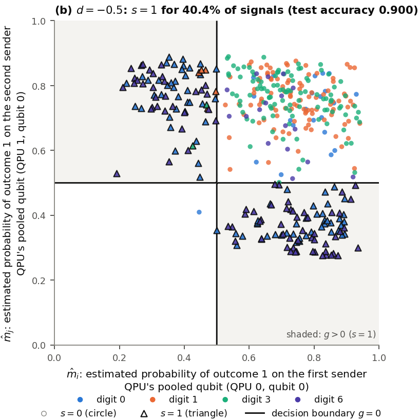

<!-- _class: tight -->

# Results Only a decision boundary that intersects the data can learn

<figure class="figure">

<video src="media/d-sweep.mp4" poster="media/d-sweep-xor.png" width="560" controls autoplay loop muted playsinline preload="none"></video>

</figure>

- XOR-type, $d=-0.875$: boundary outside the data, $s=0$ always; no gain (accuracy $0.878$, 4 digits).
- XOR-type, $d=-0.5$ (right): training forms clusters; the bit asks "0 or 6, not 1 or 3?" (accuracy $0.900$).
- Gradient only where $|g|\lesssim\sigma_g$ (shot-noise width): a boundary outside the data never learns.

<figure class="figure">

</figure>

<!-- 2026-09-29 (fixer, legibility): the bullets moved under the clip (left column) so that the trained-cluster figure could grow from h:390 to h:500 (its axis labels and digit legend were about 6 px high at 1280 x 720); "4 digits" added to the first accuracy. -->
<!-- Speaker note: sigma_g = shot-noise width of the stochastic threshold unit, sigma_g ~ K^{-1/2} (§6, App. B). -->
<!-- Speaker note (from the removed captions): left clip, a schematic distribution of untrained (m_i, m_j): gold marks g > 0, green the samples whose bit is random at K = 10^2 (not measured data). Right, after training (XOR-type, d = -0.5, seed 0, K = 10^3): triangles send s = 1. The d = -0.875 panel is not shown; NC = no communication. -->
<!-- src: Fig. 7 panels (a) d = -0.875 (bit 1 for 0.0 % of signals, test accuracy 0.878, the level without communication) and (b) d = -0.5 (boundary m_i = 1/2 and m_j = 1/2 cuts the data, four clusters, digits 0 and 6 send bit 1 = 47 % + 49 % of the bit-1 signals, 0.50 bits about the class (removed from the slide 2026-09-29, speaker: no mutual information), test accuracy 0.900): dqml-physics-results.md §5.2 "One link, coloured by class" (link round 0, QPUs 0,1 -> 2, XOR direction, K = 10^3, seed 0). -->
<!-- src: gradient only through |g| <~ sigma_g; a threshold that does not intersect the data never receives a gradient: §5.2 item 3 and §6 (d pi / d g = phi(g/sigma)/sigma, sigma_g ~ K^{-1/2}), App. B. -->
<!-- src: figure = panel (b) of Fig. 7 (dqml-physics-results-clusters-one-link.png, ~/DQML/analysis/phys-explain/out/fig_clusters_simple.png) with its legend, cropped by 3. wiki/code/lm-260929-animations/fig_resabcd.py. -->
<!-- src: clip d-sweep from 3. wiki/code/lm-260929-animations/scenes_resabcd.py (DSweep): region g > 0 and zero set from link_g, pi from link_prob at K = 10^2 (start of the annealing schedule, §0.3); green = 0.05 < pi < 0.95. _verify() checks the active interval (-1, 0) for both directions, the XOR saddle (1/2, 1/2) with g* = d + 1/2 (d = ab/c = -1/2), the topology change of {g > 0} (2 pieces -> 1) at d = -1/2, the OR saddle at the corner (1, 1), the balanced values -1/2 and -3/4, and the expansions q_XOR = 1/2 - 2 delta_i delta_j, q_OR = 3/4 + (delta_i + delta_j)/2 - delta_i delta_j (App. B). The cloud N((1/2,1/2), 0.13^2), seed 42, is schematic and labelled so in the clip itself. On-screen text re-worded in the 2026-09-28 terminology pass (XOR-type / OR-type coefficients, input-dependent range of d, distribution, samples, decision boundary, balanced bias). Poster (PDF frame) media/d-sweep-xor.png = frame at t = 10.8 s of media/d-sweep.mp4 (ffmpeg -ss 10.8, 2026-09-29): XOR-type, d = -0.50, saddle note shown, matching the bullets; the render.py default poster (media/d-sweep.png, t = 0.7 x 38.4 s; unused, moved to _removed/media/ at integration, 2026-09-29) shows OR-type at d = -0.75. -->
<!-- EDIT-FORWARD: the untrained distribution of (m_i, m_j) was not measured (§5.2 item 3 is marked [interpretation]); the cloud in the clip is a cartoon. What was measured: where the bit never changes during training, the probabilities stay near 1/2 (XOR: median q 0.50, interquartile range 0.03). The clip also shows why the XOR range is narrower: near (1/2, 1/2) the XOR variable is second order in the deviations, the OR variable first order. Fig. 7 panel (a) (d = -0.875) is not shown on the slide; it is in Fig. 7 and Fig. 8 of dqml-physics-results.md §5.2 (not in the deck). -->
<!-- EDIT-FORWARD (reviewer rv-resabcd): §5.2 item 3 says "four clusters, one per quadrant" for XOR at d = -1/2, but panel (b) of Fig. 7 (this link, seed 0) shows only three occupied quadrants: bit-1 clusters upper-left and lower-right (digits 0 and 6), one bit-0 cluster upper-right (digits 1 and 3), lower-left empty. The slide therefore says "clusters" without a count. -->
