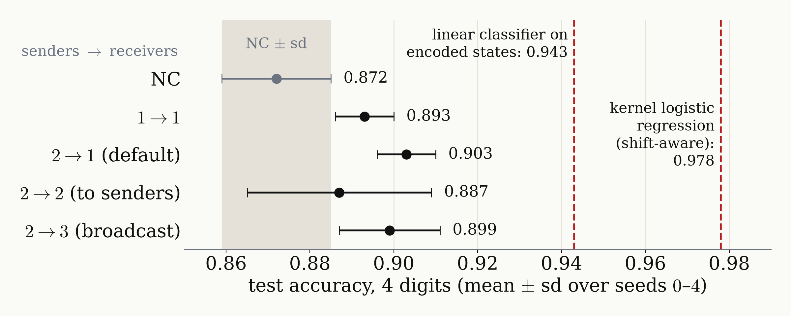

<!-- _class: tight -->

# Ongoing Doubt 2: the Fourier (DFT) encoding is too good to reveal the topology

<figure class="figure">

</figure>

- Topologies differ by at most $1.6$ points, about the seed spread.
- Every model stays below the linear classifier on the untrained encoded states ($0.943$): the encoding did most of the work.

<!-- Speaker note (was the figure caption): 3 QPUs x 4 qubits, phase on |b(m)>, contiguous feature blocks, seeds 0 to 4. Rows: communication topologies (senders -> receivers). Grey band: no communication (NC) +- one sd. Red lines: the linear classifier on the untrained encoded states (0.943) and the best classical classifier on all 40 features (0.978), a kernel logistic regression with a shift-aware kernel, chosen on validation data among 2330 classical models. Without communication the model reaches 0.865 to 0.872; an effect of the topology has little room to show below 0.943. -->
<!-- src: pattern means and sd: dqml-physics-results.md §4.3 table (none 0.872 +- 0.013; one-input 0.893 +- 0.007; two-input to third 0.903 +- 0.007; fed back 0.887 +- 0.022; broadcast 0.899 +- 0.012). No communication 0.865 +- 0.014 (seeds 0-2): §2.4 table. Linear classifier on all three untrained encoded states, revised encoding: 0.943, §2.4 table. Best classical classifier on all 40 features: 0.978, §0.1; named there since 2026-09-29 as a kernel logistic regression with a translation-aware kernel (sum of RBF kernels over the 40 cyclic width-5 sub-windows, C = 300, g = 2, chosen on validation data among 2330 candidate models); figure label "kernel logistic regression (shift-aware): 0.978", the deck-wide short label. -->
<!-- src: "No model yet exceeds the best linear classifier on its own encoded states": results page Summary and §4.2 ("Nothing beyond the linear classifier on the encoded states yet"); bound: §1 and App. A. Best n = 4 models: 0.908 +- 0.002 (§2.4), 0.917 (fixed OR test, §5.2), all below 0.943. -->
<!-- src: 1.5-3.1 points and 1.6 points are differences of the §4.3 means, checked in fig_outlook.py _verify(); one run's test accuracy has a standard error of about 0.015-0.02 (§0.3). -->
<!-- terminology pass 2026-09-28 (GLOSSARY.md): "Fourier embedding" = Fourier (DFT) encoding; "patterns" = communication topologies, figure rows relabelled NC, 1->1, 2->1 (default), 2->2 (to senders), 2->3 (broadcast); "revised encoding" = phase on |b(m)>; "windows" = feature blocks. -->
<!-- Figure: 3. wiki/code/lm-260929-animations/fig_outlook.py, 2026-09-29 (band label "NC +- sd" added when the caption was removed; x-label now "test accuracy, 4 digits (mean +- sd over seeds 0-4)" so the four-digit task is visible), numbers copied from §0.1, §2.4, §4.3; no simulation; _verify() passed. Re-rendered 2026-09-29 (speaker: "What is Best classical model?"): the dashed-line label "best classical: 0.978" now reads "kernel logistic regression (shift-aware): 0.978" (four lines, left of the line; BEST_CLASSICAL_LABEL, checked in _verify()); nothing else changed. -->
<!-- Resolved 2026-09-29 (integrator): the figure stays, since its new element is the linear-classifier line at 0.943 and the best classical line at 0.978; the first bullet no longer repeats the "1.5 to 3.1 points over NC" of the topology slide (55-patterns.md), which the figure still shows (NC band). Say it aloud if useful. -->
<!-- Checked 2026-09-29 (speaker: no mutual information, cross-entropy or D_add): neither the slide text nor outlook-too-good.png uses them; accuracies only. -->
<!-- EDIT-FORWARD: the wiki's §4.2 states the gap to the linear classifier on the *trained* encodings as 4-7 points (0.90-0.92 against 0.93-0.95); that range pools 4- and 6-qubit models, so the slide uses the untrained n = 4 value 0.943 (§2.4). -->
