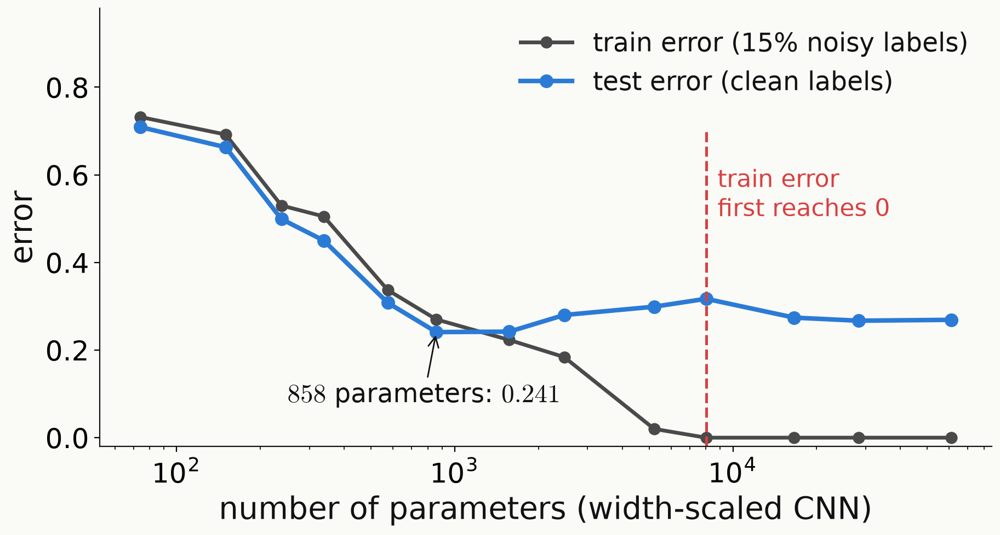

<!-- _class: tight -->

# Backup Double descent at small scale

<!-- src: mnist1d-eda.md §4.8 (width-scaled ConvBase, 15 % label noise, 250 epochs, 13 widths, one seed); 1302 parameters: dqml-physics-results.md §0.2 (Fig. 2 caption) -->

- We randomise $15\%$ of the training labels and train CNNs of width $k$, with $6k^2+58k+10$ parameters; width $k=25$ is the reference CNN.
- The test error first falls to $0.241$ at $858$ parameters, peaks at $0.317$ where the training error first reaches zero ($8010$ parameters), and falls again to about $0.27$.
- Under label noise the best model of the sweep has only $858$ parameters, the same order as the $1302$ of our quantum model, although on a different ten-class task.

<figure class="figure">

*Final training error (noisy labels) and test error (clean labels) against the parameter count; one seed.*

</figure>

Phenomenon: P. Nakkiran et al., arXiv:1912.02292; on MNIST-1D: Greydanus and Kobak, ICML 2024.

<!-- Figure: 3. wiki/code/lm-260929-animations/fig_data.py (fig_double_descent), numbers of the mnist1d-eda.md §4.8 table; _verify() checks the parameter formula for all 13 widths. -->
