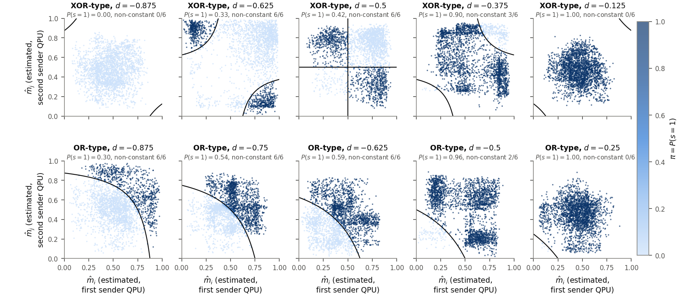

<!-- _class: section -->
<!-- _paginate: false -->

A

# Backup

Extra material for questions

---

<!-- _class: tight -->

# Results Backup: the full comparison of NC, CC and QC

Three QPUs with $n=4$ qubits, Fourier (DFT) encoding with the phase on $\lvert b(m)\rangle$, seeds 0–4; accuracy and test cross-entropy (CE, nats).

| communication (what arrives at the receiving QPU) | contiguous blocks | CE | permuted features | CE |
|---|---|---|---|---|
| NC: fresh $\vert 00\rangle$; sender applies local feed-forward | $0.875\pm0.016$ | $0.495$ | $0.800\pm0.016$ | $0.502$ |
| NC: fresh $\vert 00\rangle$; no sender feed-forward | $0.869$ | | $0.789$ | |
| NC: the receiver keeps its own qubits unmeasured | $0.871\pm0.023$ | $0.502$ | $0.796\pm0.012$ | $0.504$ |
| CC, single-shot outcome sent (measure-and-prepare); sender also applies local feed-forward | $0.877\pm0.013$ | $0.416$ | $0.795\pm0.012$ | $0.510$ |
| CC, single-shot outcome sent (measure-and-prepare); no sender feed-forward | $0.894\pm0.010$ | $0.398$ | $0.794\pm0.018$ | $0.508$ |
| **QC: the pooled qubits are sent to the receiving QPU** | $0.903\pm0.008$ | $0.375$ | $0.818\pm0.009$ | $0.478$ |
| CC: message bit from a threshold of a probability estimated from $10^3$ shots (many copies) | $0.883\pm0.009$ | $0.403$ | $0.838\pm0.039$ | $0.449$ |

| recovered fraction $R'$ | accuracy | cross-entropy | mutual information with the label at the receiver |
|---|---|---|---|
| contiguous blocks | $0.75\pm0.16$ | $0.81\pm0.15$ | $0.71\pm0.07$ |
| permuted features | $0.17\pm0.35$ | $0.36\pm0.33$ | $0.33\pm0.10$ |

Here $R'=(A_\text{CC}-A_\text{NC})/(A_\text{QC}-A_\text{NC})$, with the single-shot CC row and the fresh-$\vert 00\rangle$ NC row, both without sender feed-forward. The originally pre-registered ratio, in which the sender also applies local feed-forward, is $0.07\pm0.33$ (contiguous blocks) and $-0.31\pm0.64$ (permuted features); sender feed-forward costs $1.7\pm0.7$ percentage points on contiguous blocks.

<!-- src: dqml-physics-results.md §8.1 (channel table, R' table, "The originally pre-registered ratio" bullet). Blank CE cells: not reported on the page. -->

---

<!-- _class: tight -->

# Results Backup: the six decision functions at several values of $d$

<figure class="figure">

*Estimated outcome probabilities $(\hat m_i,\hat m_j)$ of the two sender QPUs for the six decision functions on test signals ($K=10^3$, seed 0), with the decision boundary $g=0$ at fixed $(a,b,c)$; top: XOR-type, bottom: OR-type coefficients; dark: $s=1$. Where the decision boundary lies outside the data distribution, the probabilities stay near $\tfrac12$; where it intersects the distribution, they split into clusters.*

</figure>

<!-- src: Fig. 8 of dqml-physics-results.md §5.2 (dqml-physics-results-clouds.png, from ~/DQML/analysis/phys-3b/out_std/fig_clouds_K1000.png) and "How to read Fig. 8". Deck image media/links-clouds-crop.png = the relabelled figure (standard labels, WSL re-render 2026-09-28) with its suptitle cropped by code/lm-260929-animations/fig_resabcd.py. -->

---

<!-- _class: tight -->

# Results Backup: the sweep of the bias $d$ with $K=\infty$

Accuracy with $(a,b,c)$ fixed, mean of 2 seeds. With infinitely many shots the range of $d$ in which training succeeds narrows, and 1.1 (XOR-type) and 1.7 (OR-type) percentage points are lost.

| $d$ | $-1$ | $-0.875$ | $-0.75$ | $-0.625$ | $-0.5$ | $-0.375$ | $-0.25$ | $-0.125$ | $0$ |
|---|---|---|---|---|---|---|---|---|---|
| XOR-type, $K=10^3$ | 0.871 | 0.871 | 0.866 | 0.899 | **0.905** | 0.900 | 0.869 | 0.870 | 0.870 |
| XOR-type, $K=\infty$ | 0.871 | 0.871 | 0.872 | 0.864 | 0.882 | 0.881 | 0.861 | 0.870 | 0.870 |
| OR-type, $K=10^3$ | 0.871 | 0.911 | **0.917** | 0.909 | 0.893 | 0.882 | 0.837 | 0.870 | 0.870 |
| OR-type, $K=\infty$ | 0.871 | 0.848 | 0.894 | 0.876 | 0.880 | 0.865 | 0.870 | 0.870 | 0.870 |

The XOR-type curve is symmetric, $A(d)=A(-1-d)$ ($-0.09\pm0.20$ points over 36 pairs), so there is no measurable frustration on the three-QPU cycle. Fixed coefficients give more mutual information $I(S;Y)$ than trained ones at equal accuracy (OR-type: 0.75 bits per round against 0.60–0.65), so the information in the message bits does not limit accuracy.

<!-- src: dqml-physics-results.md §5.2 accuracy table (all four rows), items 6 (symmetry, -0.09 +- 0.20 points over 36 pairs), 7 (K = infinity loses 1.1 and 1.7 points), 8 (0.75 bits against 0.60-0.65). -->

---

<!-- _class: tight -->

# Backup Double descent at small scale

<!-- src: mnist1d-eda.md §4.8 (width-scaled ConvBase, 15 % label noise, 250 epochs, 13 widths, one seed); 1302 parameters: dqml-physics-results.md §0.2 (Fig. 2 caption) -->

- We randomise $15\%$ of the training labels and train CNNs of width $k$, with $6k^2+58k+10$ parameters; width $k=25$ is the reference CNN.
- The test error first falls to $0.241$ at $858$ parameters, peaks at $0.317$ where the training error first reaches zero ($8010$ parameters), and falls again to about $0.27$.
- Under label noise the best model of the sweep has only $858$ parameters, the same order as the $1302$ of our quantum model, although on a different ten-class task.

<figure class="figure">

*Final training error (noisy labels) and test error (clean labels) against the parameter count; one seed.*

</figure>

Phenomenon: P. Nakkiran et al., arXiv:1912.02292; on MNIST-1D: Greydanus and Kobak, ICML 2024.

<!-- Figure: 3. wiki/code/lm-260929-animations/fig_data.py (fig_double_descent), numbers of the mnist1d-eda.md §4.8 table; _verify() checks the parameter formula for all 13 widths. -->
